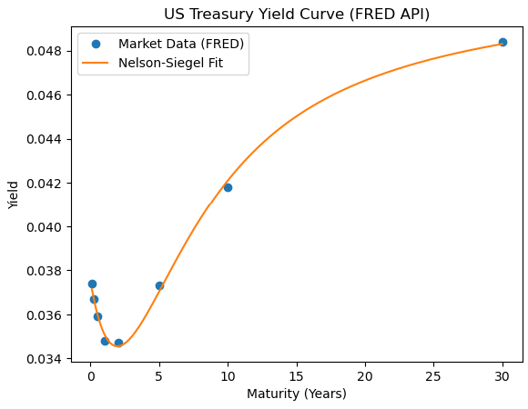
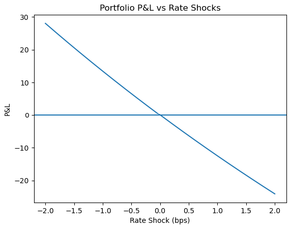

# Fixed Income Risk Engine (Yield Curve + DV01 + KRDV01)

## Overview
A Python-based fixed income risk engine that models yield curves, prices bonds, and evaluates interest rate risk using DV01, duration, convexity, and key rate sensitivity analysis. The project uses real US Treasury data to simulate portfolio behavior under interest rate shocks.

---

## Data Source
- US Treasury Constant Maturity Rates (modeled from market yield curve data)

---

## Yield Curve Data (Snapshot)

| Maturity (Years) | Yield |
|------------------|-------|
| 0.0833 | 0.0374 |
| 0.25   | 0.0367 |
| 0.50   | 0.0359 |
| 1.00   | 0.0348 |
| 2.00   | 0.0347 |
| 5.00   | 0.0373 |
| 10.00  | 0.0418 |
| 30.00  | 0.0484 |

---

## Key Portfolio Results

### Portfolio Valuation Under Rate Shocks

| Scenario | Portfolio Value |
|----------|----------------|
| Base Case | **249.10** |
| +100 bps Shock | **236.61** |
| -100 bps Shock | **262.58** |

### P&L Impact
- Loss under +100bps: **-12.49**
- Gain under -100bps: **+13.48**

---

## Risk Metrics

### Portfolio DV01
- **0.1297**

### Key Rate DV01 (KRDV01)
| Maturity | KRDV01 |
|----------|--------|
| 2Y  | 0.0184 |
| 5Y  | 0.0414 |
| 10Y | 0.0699 |

---

## Key Insights

- Portfolio exhibits **non-linear interest rate sensitivity**
- Gains from rate declines exceed losses from rate increases → **convexity effect**
- Risk exposure is concentrated in the **long-end (10Y bucket dominates KRDV01)**
- Duration alone underestimates portfolio risk under stress scenarios

---

## Methodology

### 1. Yield Curve Construction
- Built using term structure of Treasury yields
- Maturity spectrum from 1M to 30Y

### 2. Fixed Income Pricing Engine
- Discounted cash flow bond pricing
- Coupon and maturity-based valuation

### 3. Risk Analytics
- DV01 (Dollar Value of 1 basis point)
- Duration and convexity approximation
- Key Rate DV01 decomposition

### 4. Stress Testing
- Parallel rate shocks (+/- 100 bps)
- Portfolio-level P&L simulation

---

## Tech Stack
Python, NumPy, Pandas, SciPy, Matplotlib

---

## Visual Results

### US Treasury Yield Curve

*Yield curve constructed from observed market data across 1M–30Y maturities.*

---

### Portfolio P&L Under Interest Rate Shocks

*Non-linear P&L response demonstrating convexity effects under parallel rate shocks.*

---

## Use Case
This project simulates a simplified rates risk engine similar to those used in:
- Market Risk teams
- Fixed Income trading desks
- Counterparty Credit Risk (CCR) analysis

---

## Author
Ranveer Bhalla
